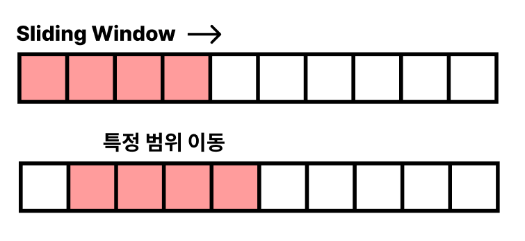

# 슬라이딩 윈도우

- 윈도우(특정 범위)가 있을 때, 윈도우 내부 요소의 값을 이용하여 문제를 풀이하는 알고리즘.

- 이미 한번 구했던 값을 버리지 않고 재사용 함으로써, 고정적인 범위를 탐색할 경우 유용.
- 시간복잡도 `O(N)`

### 문제

- [[BOJ] 12891 / DNA 비밀번호](https://github.com/chaeryeon823/Coding-Test/blob/main/BOJ/12891.py)
